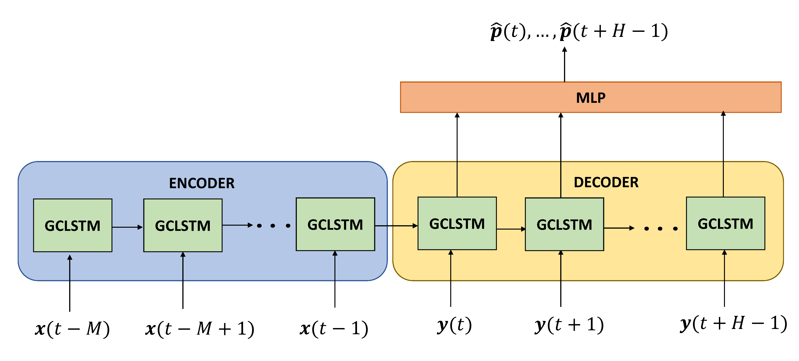

# GCLSTM
Implementation of the GCLSTM architecture proposed in the paper [Spatio-temporal graph neural networks formulti-site PV power forecasting](https://arxiv.org/pdf/2107.13875)

   
  
    Source: Source: Simeunovic et al., 2021 — Spatio-temporal graph neural networks for multi-site PV power forecasting
  

